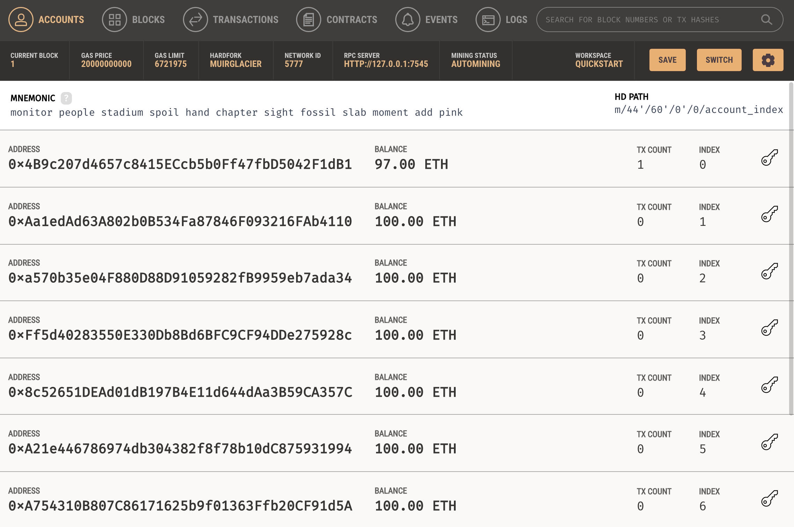
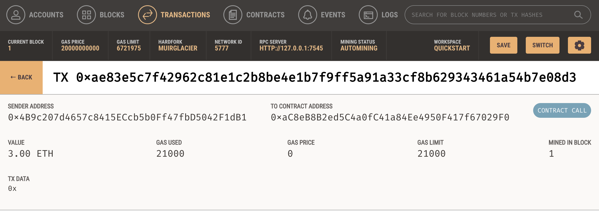
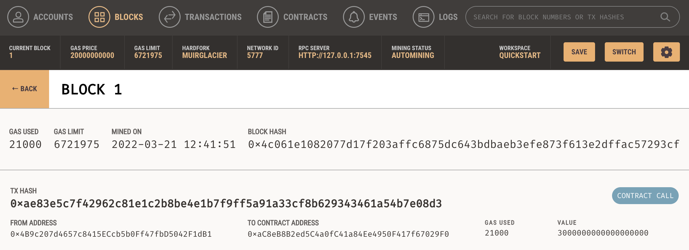

# Cryptocurrency-Wallet

## Homework Objectives:

1. Generate a new Ethereum account instance by using the mnemonic seed phrase provided by Ganache.
2. Fetch and display the account balance associated with your Ethereum account address.
3. Calculate the total value of an Ethereum transaction, including the gas estimate, that pays a Fintech Finder candidate for their work.
4. Digitally sign a transaction that pays a Fintech Finder candidate, and send this transaction to the Ganache blockchain.
5. Review the transaction hash code associated with the validated blockchain transaction.

## Homework Outcomes:

**Streamlit Homepage**
---

**Ganache Account History**
---

**Ganache Transaction Detail**
---

**Ganache Block Detail**
---
